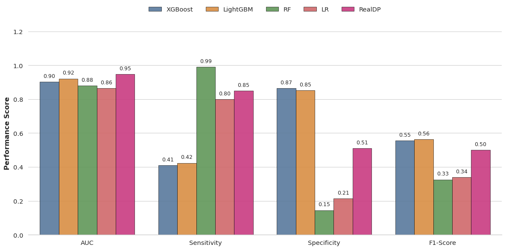

# ICU Clinical Time-Series Analysis Project 🏥

본 프로젝트는 **Nature Digital Medicine (2025)**에 게재된 논문 [*Unlocking the potential of real-time ICU mortality prediction (RealMIP)*](https://doi.org/10.1038/s41746-025-02114-y)를 기반으로 구현된 AI 파이프라인입니다.

**MIMIC-IV** 데이터를 활용하여 ICU 환자의 불규칙한 시계열 데이터 결측치를 동적으로 복원(Generative Imputation)하고, 실시간 사망 위험을 예측하는 딥러닝 모델을 제안합니다.

---

## 📘 Model Architecture & Details

**Main Model**은 논문에서 제안한 **RealMIP(Real-time Mortality Interaction Prediction)** 프레임워크의 핵심 아이디어를 차용하여 설계되었습니다.

* **Continuous Data Recovery**: 생성형 모델(Generative Model)을 통해 불규칙한 시계열 데이터의 결측치를 정교하게 복원합니다.
* **Real-time Risk Assessment**: 복원된 데이터를 바탕으로 환자의 상태 변화를 실시간으로 추적하여 사망률을 예측합니다.

모델의 구체적인 수식, 아키텍처 다이어그램, 실험 디테일은 아래 **Notion 페이지**에 정리되어 있습니다.

> 👉 **[Notion: 모델 상세 설명 및 분석 보러가기](https://even-slouch-300.notion.site/RealMIP-Real-Time-ICU-Mortality-Prediction-via-Continuous-Data-Imputation-2e6de5411ed9804faa88ce00aec9f921)**

---

## 📂 Code Structure

전체 파이프라인은 **데이터 구축 → 모델 학습(Main vs Baseline) → 검증 및 해석** 순서로 구성됩니다.

| Step | File Name | Description |
| :--- | :--- | :--- |
| **1. Data** | **`Cohort_build.ipynb`** | SQL을 통한 환자군(Cohort) 정의 및 Raw Data 전처리 (CSV 생성) |
| | **`Dataset_EDA.ipynb`** | 데이터 기초 통계, 관측 간격(Time-step) 및 결측치 패턴 분석 |
| **2. DL** | **`MainModel.ipynb`** | **[Proposed]** 논문 기반 시계열 딥러닝 모델 학습 (Generative Imputation & Prediction) |
| **3. ML** | **`Comparison_model.ipynb`** | Baseline 모델(XGBoost, RF) 학습 및 성능 비교 (Permutation Importance) |
| | `Comparison(Boosting)_EDA.ipynb` | ML 모델 학습을 위한 추가 Feature Engineering 및 분석 |
| **4. Val** | **`Validation_pipeline.ipynb`** | 최종 모델 검증 및 **SHAP** 기반 변수 중요도(Feature Importance) 해석 |

## 🛠 Environments
* **Reference Paper**: [Unlocking the potential of real-time ICU mortality prediction (2025)](https://doi.org/10.1038/s41746-025-02114-y)
* **Data**: MIMIC-IV Database (Access Required)
* **Stack**: Python, PyTorch, XGBoost, SHAP, Pandas

## 🚀 How to Run
1.  `Cohort_build.ipynb` 실행 (Dataset 생성)
2.  `MainModel.ipynb` 실행 (논문 기반 모델 학습)
3.  `Validation_pipeline.ipynb` 실행 (결과 해석 및 시각화)
